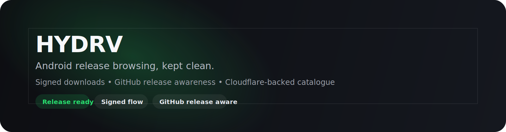
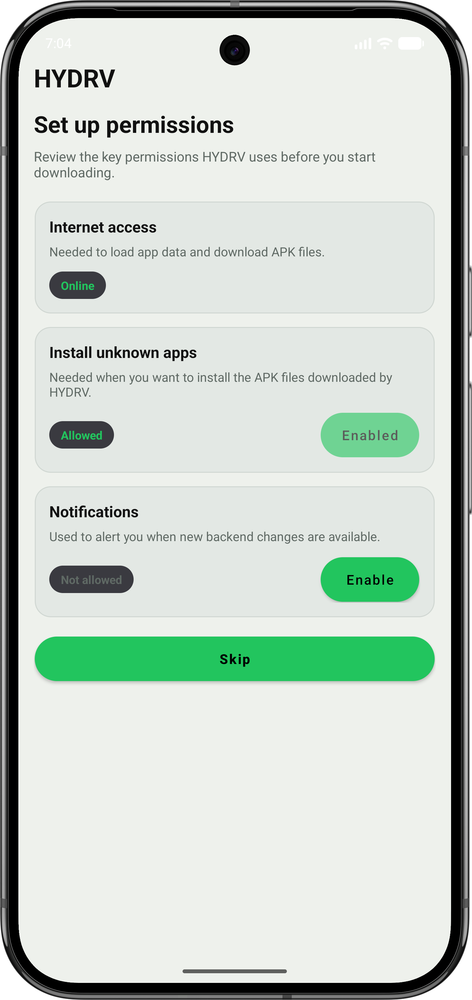
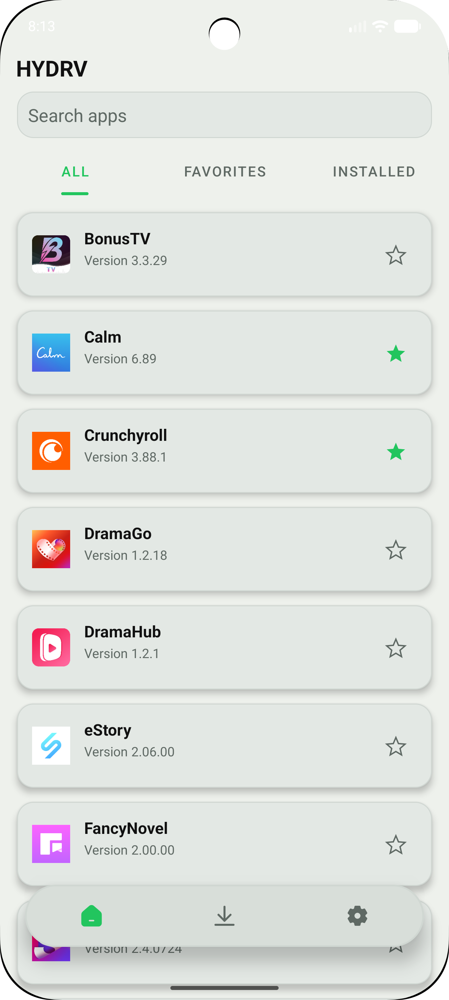
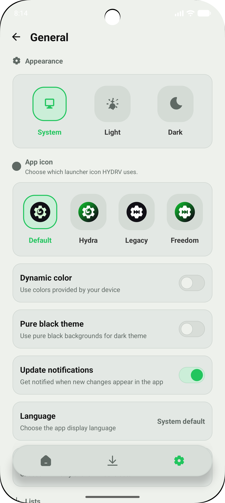
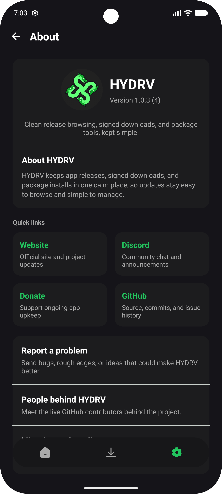
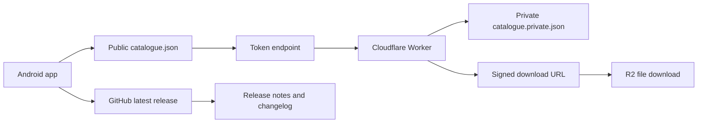



  

<em>HYDRV is a personalized store made just for you.</em>

  
  
  
  
  

  

    <a href="https://github.com/Team-HYDRV/HYDRV/releases/latest">Latest release</a>
    &middot;
    <a href="https://hydrv.app">Website</a>
    &middot;
  &middot;
  <a href="HYDRV/docs/backend-example.md">Backend guide</a>
    &middot;
    <a href="HYDRV/docs/samples/catalogue.json">Sample catalogue</a>
  &middot;
  <a href="RELEASES.md">Release checklist</a>
  &middot;
  <a href="CHANGELOG.md">Changelog</a>
  &middot;
  <a href="HYDRV/docs/index.md">Docs</a>

---

<h2 align="center">Highlights</h2>

<table>
  <tr>
    <td width="25%" valign="top" align="center">
      <h3>Release browsing</h3>
      
Open apps, check their releases, and move through versions without extra clutter.

    </td>
    <td width="25%" valign="top" align="center">
      <h3>Signed downloads</h3>
      
The public catalogue stays simple while the Worker takes care of the real download path.

    </td>
    <td width="25%" valign="top" align="center">
      <h3>Flexible setup</h3>
      
Theme, language, lists, backend sources, and launcher icons are all built in.

    </td>
    <td width="25%" valign="top" align="center">
      <h3>Support tools</h3>
      
Export reports, backend health, update info, and project links stay easy to reach.

    </td>
  </tr>
</table>

---

<h2 align="center">Screenshots</h2>

<table>
  <tr>
    <td width="25%" align="center" valign="top">
      
      
<strong>Permissions</strong> Clear setup steps before you start downloading.

    </td>
    <td width="25%" align="center" valign="top">
      
      
<strong>Home</strong> Browse releases, track versions, and keep installs organized.

    </td>
    <td width="25%" align="center" valign="top">
      
      
<strong>General</strong> Theme, language, and list controls in one place.

    </td>
    <td width="25%" align="center" valign="top">
      
      
<strong>About</strong> Project info, quick links, and the current brand.

    </td>
  </tr>
</table>

---

<h2 align="center">How To Use</h2>

<ol>
  <li><strong>Open the app and allow permissions.</strong> HYDRV needs internet access and install permissions before it can fetch or install APKs.</li>
  <li><strong>Start on Home.</strong> This is where you browse apps, open a release, pick a version, and download the one you want.</li>
  <li><strong>Save apps to Favorites.</strong> Tap the star on anything you want to come back to later without searching again.</li>
  <li><strong>Check Installed.</strong> Use this tab to compare what is already on your device with what is available in HYDRV.</li>
  <li><strong>Open Downloads when a file is ready.</strong> From there you can install APKs, retry failed downloads, or clear older items you no longer need.</li>
  <li><strong>Adjust General.</strong> This is where you change theme, language, sorting, backend sources, and the launcher icon.</li>
  <li><strong>Visit About.</strong> Use About for app info, report export, support links, and quick project details.</li>
</ol>

<h2 align="center">What Each Tab Is For</h2>

<table>
  <tr>
    <td width="33%" valign="top" align="center">
      <h3>Home</h3>
      
Home is where you browse the catalogue, open app pages, compare versions, and start downloads.

    </td>
    <td width="33%" valign="top" align="center">
      <h3>Favorites</h3>
      
Favorites keeps the apps you care about close by, so you do not have to search every time.

    </td>
    <td width="33%" valign="top" align="center">
      <h3>Installed</h3>
      
Installed shows what is already on your device and makes it easy to spot when a newer version is available.

    </td>
  </tr>
  <tr>
    <td width="33%" valign="top" align="center">
      <h3>Downloads</h3>
      
Downloads is your queue. You can watch progress, install finished APKs, retry failures, or clear old entries.

    </td>
    <td width="33%" valign="top" align="center">
      <h3>General</h3>
      
General is where you tune HYDRV itself with theme, language, sorting, backend, and launcher icon settings.

    </td>
    <td width="33%" valign="top" align="center">
      <h3>About</h3>
      
About gives you the app version, support links, export tools, and the quick project details people usually need first.

    </td>
  </tr>
</table>

<h2 align="center">Backend Tutorial</h2>

  HYDRV also supports custom backends if you want to point the catalogue somewhere else.

<table>
  <tr>
    <td width="50%" valign="top">
      <h3 align="center">What it does</h3>
      <ul>
        <li>Points HYDRV at your own catalogue JSON.</li>
        <li>Keeps private, test, or mirrored sources separate from the default backend.</li>
        <li>Gives you a way to organize apps by purpose, region, or release flow.</li>
      </ul>
    </td>
    <td width="50%" valign="top">
      <h3 align="center">Why it helps</h3>
      <ul>
        <li>You can run a private app list.</li>
        <li>You can test a staging backend before pushing it live.</li>
        <li>You can switch back to the default HYDRV backend any time you want the built-in source again.</li>
      </ul>
    </td>
  </tr>
</table>

<ol>
  <li>Open <strong>Settings</strong> and go to <strong>General &gt; Backend</strong>.</li>
  <li>Add or select a custom backend URL.</li>
  <li>Make sure the backend returns valid HYDRV catalogue data.</li>
  <li>Switch back to <strong>Default</strong> whenever you want the built-in source again.</li>
</ol>

  <strong>Good to know:</strong> if a backend is broken or unreachable, HYDRV may not be able to load apps from it. For most people, the default backend is still the easiest choice.

<h2 align="center">How It Fits Together</h2>

  HYDRV keeps the public release flow simple: the app reads the visible catalogue, the Worker signs the real download path, and GitHub stays the source of truth for release notes.

<h2 align="center">Visual Identity</h2>

  

<h2 align="center">Quick Start</h2>

1. Open `HYDRV/` in Android Studio.
2. Sync Gradle.
3. Run the app on a device or emulator.

<h2 align="center">Build</h2>

Use these commands from `HYDRV/` if you want to build from the terminal:

- `.\gradlew.bat assembleDebug` to build a debug APK
- `.\gradlew.bat assembleRelease` to build a release APK

<h2 align="center">Project Structure</h2>

<ul>
  <li><code>HYDRV/</code> - Android app source</li>
  <li><code>HYDRV/docs/</code> - backend, release, and docs hub</li>
  <li><code>assets/</code> - README branding, banner, and screenshot assets</li>
  <li><code>.github/</code> - CI, release, and contribution automation</li>
  <li><code>CHANGELOG.md</code> - release note template</li>
  <li><code>RELEASES.md</code> - tag and publish checklist</li>
</ul>

<h2 align="center">For Contributors</h2>

<table>
  <tr>
    <td width="50%" valign="top">
      <h3 align="center">Before you send a PR</h3>
      <ul>
        <li>Open the app in Android Studio and run <code>assembleDebug</code>.</li>
        <li>Update the release checklist if you tag a new build.</li>
        <li>Keep screenshots and docs in sync with visible UI changes.</li>
      </ul>
    </td>
    <td width="50%" valign="top">
      <h3 align="center">Keep an eye on</h3>
      <ul>
        <li>The public catalogue should stay aligned with the backend example.</li>
        <li>Release note wording should also reflect GitHub releases.</li>
        <li>Brand assets belong in <code>assets/</code> so the README can render them cleanly.</li>
      </ul>
    </td>
  </tr>
</table>

<h2 align="center">Translations</h2>

HYDRV keeps its Android strings in `HYDRV/app/src/main/res/values/strings.xml`.  
Translations live on Crowdin at `translate.hydrv.app`, and the matching `values-xx` folders in this repo stay in sync with the app.

<ol>
  <li>Add or edit the source strings in the default <code>values/strings.xml</code> file.</li>
  <li>Sync the project with Crowdin.</li>
  <li>Let Crowdin export translated <code>strings.xml</code> files back into the matching locale folders.</li>
</ol>

  The repo keeps Android locale folders like <code>pt-rBR</code> and <code>zh-rCN</code> aligned with the app, so translated files land where HYDRV expects them.

