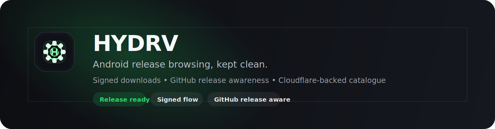
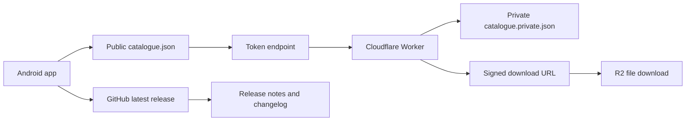
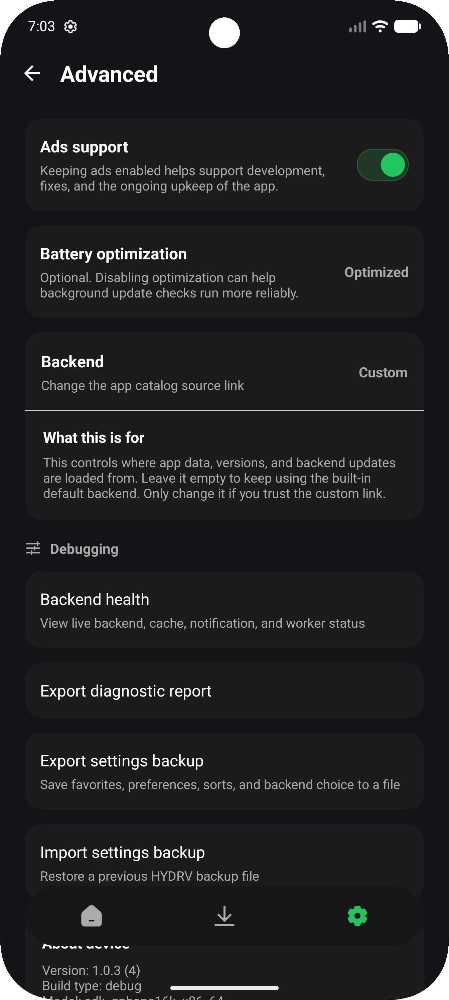

<p align="center">
  
</p>

<p align="center">
  
</p>

<h1 align="center">HYDRV</h1>

<p align="center">
  <strong>Android release browsing, kept clean.</strong>
</p>

<p align="center">
  <em>An Android release browser with a Cloudflare-backed catalogue, GitHub release awareness, and a polished update flow.</em>
</p>

<p align="center">
  <a href="https://github.com/Team-HYDRV/HYDRV/actions/workflows/android-ci.yml">
    
  </a>
  <a href="https://github.com/Team-HYDRV/HYDRV/releases/latest">
    
  </a>
  <a href="https://hydrv.app">
    
  </a>
  <a href="https://ko-fi.com/xc3fff0e">
    
  </a>
</p>

<p align="center">
  <a href="https://github.com/Team-HYDRV/HYDRV/releases/latest">Latest release</a>
  &middot;
  <a href="https://hydrv.app">Website</a>
  &middot;
  <a href="HYDRV/docs/backend-example.md">Backend example</a>
  &middot;
  <a href="RELEASES.md">Release checklist</a>
  &middot;
  <a href="CHANGELOG.md">Changelog</a>
  &middot;
  <a href="HYDRV/docs/index.md">Docs</a>
</p>

---

## Snapshot

<table>
  <tr>
    <td width="33%" valign="top">
      <h3>App</h3>
      <p>Browse releases, queue downloads, and manage installs from Android.</p>
    </td>
    <td width="33%" valign="top">
      <h3>Backend</h3>
      <p>Resolve the private file path and issue signed download URLs through Cloudflare.</p>
    </td>
    <td width="33%" valign="top">
      <h3>Website</h3>
      <p>Show the latest release story, changelogs, and supporting pages in a public landing page.</p>
    </td>
  </tr>
</table>

## Release Preview

<table>
  <tr>
    <td width="66%" valign="top">
      <h3>Latest GitHub release</h3>
      <p>The app and website both point to the repository's latest release so the public story stays in sync.</p>
      <p>
        <a href="https://github.com/Team-HYDRV/HYDRV/releases/latest"><strong>Open latest release</strong></a>
        &middot;
        <a href="CHANGELOG.md"><strong>Read changelog template</strong></a>
      </p>
    </td>
    <td width="34%" valign="top">
      <h3>Public release flow</h3>
      <p>Tag a build, publish the GitHub release, and let the app surface the same notes to users.</p>
    </td>
  </tr>
</table>

## Highlights

<table>
  <tr>
    <td width="50%" valign="top">
      <h3>Polished release browsing</h3>
      <p>Open an app, scan its versions, and move through release details without clutter.</p>
    </td>
    <td width="50%" valign="top">
      <h3>Signed download flow</h3>
      <p>The public catalogue points at token endpoints, while the Worker keeps the real file path private.</p>
    </td>
  </tr>
  <tr>
    <td width="50%" valign="top">
      <h3>GitHub release awareness</h3>
      <p>The app and website both surface the latest GitHub release so changelogs stay aligned.</p>
    </td>
    <td width="50%" valign="top">
      <h3>Clean project tooling</h3>
      <p>CI, release automation, docs, contribution templates, and support links are already in place.</p>
    </td>
  </tr>
</table>

## How It Fits Together



## Quick Links

- [Latest GitHub release](https://github.com/Team-HYDRV/HYDRV/releases/latest)
- [Public website](https://hydrv.app)
- [Backend example](HYDRV/docs/backend-example.md)
- [Docs landing page](HYDRV/docs/index.md)
- [Release checklist](RELEASES.md)
- [Changelog](CHANGELOG.md)
- [Support on Ko-fi](https://ko-fi.com/xc3fff0e)

## Screenshots

<table>
  <tr>
    <td width="33%" align="center" valign="top">
      
      <p><strong>About</strong><br>Brand-forward app identity, quick links, and project info.</p>
    </td>
    <td width="33%" align="center" valign="top">
      
      <p><strong>Permissions</strong><br>Clear setup steps before you start downloading.</p>
    </td>
    <td width="33%" align="center" valign="top">
      
      <p><strong>Advanced</strong><br>Backend controls, diagnostics, and support options.</p>
    </td>
  </tr>
</table>

## At a Glance

| Area | What it covers |
| --- | --- |
| App | Browse releases, queue downloads, and manage installs from Android. |
| Backend | Serve the public catalogue and resolve signed download links. |
| Website | Present the public project, latest releases, and supporting pages. |
| Releases | Publish APK builds through GitHub tags and release automation. |

## Visual Identity

<p align="center">
  
</p>

## Quick Start

1. Open `HYDRV/` in Android Studio.
2. Sync Gradle.
3. Run the app on a device or emulator.

## Build

From `HYDRV/`:

```powershell
.\gradlew.bat assembleDebug
```

## Project Structure

- `HYDRV/` - Android app source
- `HYDRV/docs/` - backend, release, and docs landing pages
- `assets/` - README branding, banner, and screenshot assets
- `.github/` - CI, release, and contribution automation
- `CHANGELOG.md` - release note template
- `RELEASES.md` - tag and publish checklist

## Release Flow

See [`RELEASES.md`](RELEASES.md) for the tag and publish checklist.

## Backend Example

See [`HYDRV/docs/backend-example.md`](HYDRV/docs/backend-example.md) for a Cloudflare Worker and R2 example that matches the app's signed download flow.

## App Notes

- The app reads a public `catalogue.json` and a private `catalogue.private.json`.
- Public catalogue entries point at token URLs.
- The Worker resolves the private path and returns a signed download URL.
- The app checks GitHub releases for update awareness.

## Contribution Notes

- Open issues with the templates in `.github/ISSUE_TEMPLATE/`
- Open pull requests with the template in `.github/PULL_REQUEST_TEMPLATE.md`
- Keep release notes in [`CHANGELOG.md`](CHANGELOG.md)
- GitHub Actions handles CI and APK release builds

## Website

The public website is hosted separately on Cloudflare and is not part of this repository.
